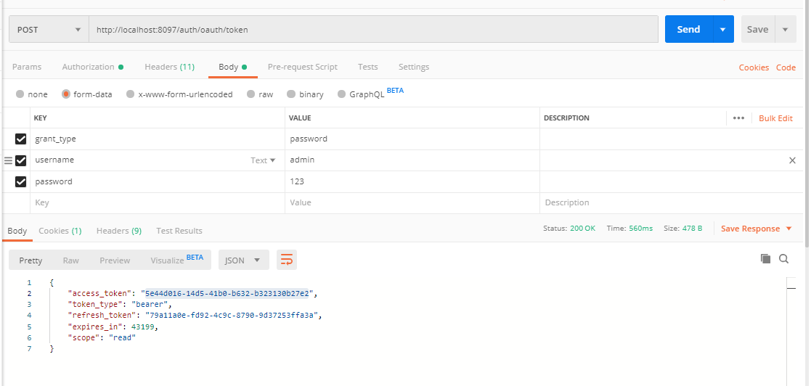
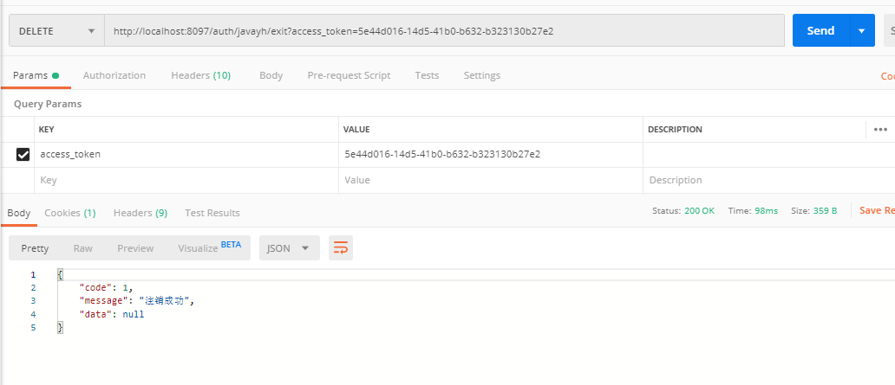

## javayh-nacos-oauth 验证流程

启动流程：
- 需要启动nacos
- 启动javayh-nacos-oauth
- 启动javayh-nacos-zuul

## PostMan测试
### 生成token
- 配置auth
配置完成会在header里生成 Authorization
 
- 账户密码配置
 
 
### 验证注销

### 验证查询

http://localhost:8097/auth/javayh/user?access_token=xxxxxxx

### 客户端配置
https://blog.csdn.net/weixin_38937840/article/details/90321037
### 客户源代码
https://github.com/Dylan-haiji/javayh-cloud/tree/master/javayh-shop